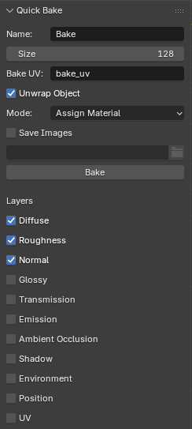

# Quick Bake

Quick and simple baking in Blender.

**ToDo**

- [ ] Add docs for how to download from release
- [ ] Tests + Coverage
- [ ] Can any blender extension code become more modern?
- [ ] Show progress (wm cursor)
- [ ] Render custom passes (eg. metallic) with emit channel
- [ ] Replace all materials of multi material object with one

## Usage

Download this repo as a zip file and install through the Blender addons.

### Interface

### Inputs

| Field         | Description                                            |
| ------------- | ------------------------------------------------------ |
| Name          | Name used for baked images and material                |
| Mode          | What to do with images after bake                      |
| Size          | Bake image size in pixels                              |
| Bake UV       | UV layer name used for baking                          |
| Unwrap Object | Unwrap the object using smart project before baking    |
| Save Images   | Save images to external directory                      |
| Layers        | Enable baking of different layers, one image per layer |

Mode has the following options

| Mode            | Description                                          |
| --------------- | ---------------------------------------------------- |
| Image Only      | Only generate images                                 |
| Create Material | Create a new material with the baked images          |
| Assign Material | Assign the material to active object                 |
| Copy Object     | Duplicate the object before assigning baked material |
